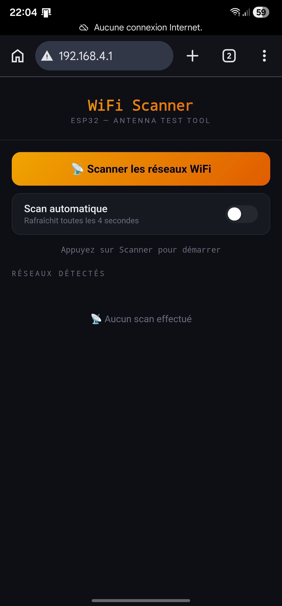
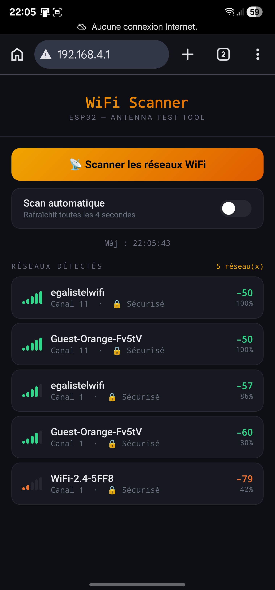
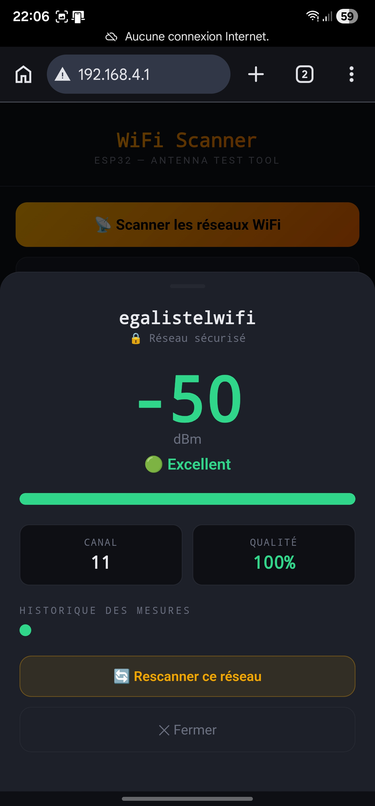

# 📡 ESP32 WiFi Scanner

> **Outil de scan WiFi avec interface web — Web-based WiFi Scanner Tool**  
> ESP32 · Access Point · Mobile Friendly · No dependencies

---

[](https://github.com/egamaker/ESP32-WiFiScanner)
[](LICENSE)
[](https://www.espressif.com)
[](https://egamaker.be)
[](https://buymeacoffee.com/egalistelw)

---

> 🛒 **Matériel utilisé dans ce projet / Hardware used in this project** : [ESP32-DevKitC sur AliExpress](https://s.click.aliexpress.com/e/_c3s7KU8L) *(lien affilié / affiliate link)*

---

## 🇫🇷 Français | 🇬🇧 [English](#-english)

---

## 🇫🇷 Français

### Présentation

ESP32 WiFi Scanner est un outil simple et portable qui transforme votre ESP32 en scanner WiFi avec interface web mobile.  
Aucune installation, aucun serveur externe — l'ESP32 crée son propre point d'accès et sert l'interface directement sur votre téléphone.

Idéal pour :
- Comparer deux antennes WiFi et choisir la meilleure
- Analyser la couverture WiFi d'un local ou d'une pièce
- Diagnostiquer des problèmes de signal
- Tout projet ESP32 nécessitant une mesure de signal préalable

---

### ✨ Fonctionnalités

- 📡 **Scan de tous les réseaux WiFi** à portée, triés par puissance
- 📊 **Barres de signal visuelles** colorées (vert / orange / rouge)
- 🔍 **Vue détail par réseau** — RSSI, canal, sécurité, qualité en %
- 📈 **Historique des mesures** par réseau (points colorés)
- 🔄 **Scan automatique** toutes les 4 secondes (toggle)
- 📱 **Interface mobile optimisée** — fonctionne dans n'importe quel navigateur
- 🔌 **Aucune dépendance externe** — WiFi et WebServer inclus dans le package ESP32

---

### 📋 Matériel requis

| Composant | Détail |
|-----------|--------|
| **ESP32** | N'importe quel modèle (DevKit, Wemos, etc.) |
| **Câble USB** | Pour flasher le firmware |
| **Téléphone ou PC** | Pour accéder à l'interface web |

> Compatible avec tous les modèles ESP32. Testé sur ESP32-DevKitC V4.

---

### 🚀 Installation

#### 1. Installer le support ESP32 dans Arduino IDE

Dans **Fichier → Préférences**, ajouter l'URL suivante dans "URL de gestionnaire de cartes supplémentaires" :

```
https://raw.githubusercontent.com/espressif/arduino-esp32/gh-pages/package_esp32_index.json
```

Puis **Outils → Type de carte → Gestionnaire de cartes**, rechercher **esp32** et installer **esp32 by Espressif Systems**.

#### 2. Sélectionner la carte

**Outils → Type de carte → ESP32 Arduino → ESP32 Dev Module**

Paramètres recommandés :

| Paramètre | Valeur |
|-----------|--------|
| Upload Speed | 921600 |
| CPU Frequency | 240MHz |
| Flash Size | 4MB |
| Partition Scheme | Default 4MB |

#### 3. Flasher

1. Ouvrir `ESP32_WiFiScanner.ino` dans Arduino IDE
2. Sélectionner le bon port COM
3. Cliquer **Upload**

> ⚠️ **Si l'upload bloque sur "Connecting..."** : maintenez le bouton **BOOT** de l'ESP32 enfoncé dès que "Connecting..." apparaît, relâchez dès que l'upload démarre.

---

### 📱 Utilisation

1. **Alimenter l'ESP32** (USB ou batterie)
2. Sur votre téléphone, se connecter au WiFi :
   - **Réseau** : `ESP32-WiFiScanner`
   - **Mot de passe** : `wifiscan32`
3. Ouvrir le navigateur sur **`http://192.168.4.1`**
4. Appuyer sur **"Scanner les réseaux WiFi"**
5. Cliquer sur un réseau pour voir le détail

---

### 🖼️ Aperçu

#### Interface principale — avant scan



#### Liste des réseaux détectés



#### Vue détail d'un réseau (clic sur un réseau)



---

### 📊 Interprétation du signal

| RSSI | Qualité | Couleur |
|------|---------|---------|
| > -50 dBm | 🟢 Excellent | Vert |
| -50 à -60 dBm | 🟢 Bon | Vert |
| -60 à -70 dBm | 🟡 Moyen | Orange |
| -70 à -80 dBm | 🟠 Faible | Orange foncé |
| < -80 dBm | 🔴 Mauvais | Rouge |

---

### 🔧 Personnalisation

Deux constantes en haut du sketch permettent de changer le réseau AP :

```cpp
#define AP_SSID  "ESP32-WiFiScanner"   // Nom du réseau créé par l'ESP32
#define AP_PASS  "wifiscan32"          // Mot de passe (8 caractères minimum)
```

---

### 🤝 Contribution

Les contributions sont les bienvenues !  
Ouvrez une **Issue** pour signaler un bug ou proposer une fonctionnalité.  
Soumettez une **Pull Request** pour contribuer directement.

---

### ☕ Soutenir le projet

Si cet outil vous est utile, vous pouvez soutenir son développement :

[](https://buymeacoffee.com/egalistelw)

### 🛒 Matériel

Vous pouvez vous procurer le matériel nécessaire via ces liens :

| Composant | Lien |
|-----------|------|
| ESP32-DevKitC | [AliExpress](https://s.click.aliexpress.com/e/_c3s7KU8L) *(affilié)* |

---

### 📄 Licence

MIT License — voir [LICENSE](LICENSE)

---
---

## 🇬🇧 English

### Overview

ESP32 WiFi Scanner is a simple, portable tool that turns your ESP32 into a WiFi scanner with a mobile web interface.  
No installation, no external server — the ESP32 creates its own access point and serves the interface directly to your phone.

Perfect for:
- Comparing two WiFi antennas to pick the best one
- Analyzing WiFi coverage in a room or building
- Diagnosing signal issues
- Any ESP32 project requiring a preliminary signal measurement

---

### ✨ Features

- 📡 **Scan all nearby WiFi networks**, sorted by signal strength
- 📊 **Color-coded signal bars** (green / orange / red)
- 🔍 **Per-network detail view** — RSSI, channel, security, quality %
- 📈 **Measurement history** per network (colored dots)
- 🔄 **Auto-scan** every 4 seconds (toggle)
- 📱 **Mobile-optimized interface** — works in any browser
- 🔌 **No external dependencies** — WiFi and WebServer included in ESP32 package

---

### 📋 Required Hardware

| Component | Details |
|-----------|---------|
| **ESP32** | Any model (DevKit, Wemos, etc.) |
| **USB cable** | To flash the firmware |
| **Phone or PC** | To access the web interface |

---

### 🚀 Installation

#### 1. Install ESP32 support in Arduino IDE

In **File → Preferences**, add the following URL to "Additional boards manager URLs":

```
https://raw.githubusercontent.com/espressif/arduino-esp32/gh-pages/package_esp32_index.json
```

Then **Tools → Board → Boards Manager**, search **esp32** and install **esp32 by Espressif Systems**.

#### 2. Select the board

**Tools → Board → ESP32 Arduino → ESP32 Dev Module**

#### 3. Flash

1. Open `ESP32_WiFiScanner.ino` in Arduino IDE
2. Select the correct COM port
3. Click **Upload**

> ⚠️ **If upload hangs on "Connecting..."**: hold the **BOOT** button on the ESP32 as soon as "Connecting..." appears, release once upload starts.

---

### 📱 Usage

1. **Power the ESP32** (USB or battery)
2. On your phone, connect to WiFi:
   - **Network**: `ESP32-WiFiScanner`
   - **Password**: `wifiscan32`
3. Open browser at **`http://192.168.4.1`**
4. Tap **"Scanner les réseaux WiFi"**
5. Tap any network to see details

---

### 🖼️ Preview

#### Main screen — before scan


#### Network list after scan


#### Network detail view (tap on a network)


---

### 📊 Signal interpretation

| RSSI | Quality | Color |
|------|---------|-------|
| > -50 dBm | 🟢 Excellent | Green |
| -50 to -60 dBm | 🟢 Good | Green |
| -60 to -70 dBm | 🟡 Fair | Orange |
| -70 to -80 dBm | 🟠 Weak | Dark orange |
| < -80 dBm | 🔴 Poor | Red |

---

### 🔧 Customization

Two constants at the top of the sketch let you change the AP network:

```cpp
#define AP_SSID  "ESP32-WiFiScanner"   // Network name created by the ESP32
#define AP_PASS  "wifiscan32"          // Password (8 characters minimum)
```

### ☕ Support the project

If this tool is useful to you, you can support its development:

[](https://buymeacoffee.com/egalistelw)

### 🛒 Hardware

You can get the required hardware via these links:

| Component | Link |
|-----------|------|
| ESP32-DevKitC | [AliExpress](https://s.click.aliexpress.com/e/_c3s7KU8L) *(affiliate)* |

---

### 📄 License

MIT License — see [LICENSE](LICENSE)

---

*Made with ☕ by [egamaker.be](https://egamaker.be)*
